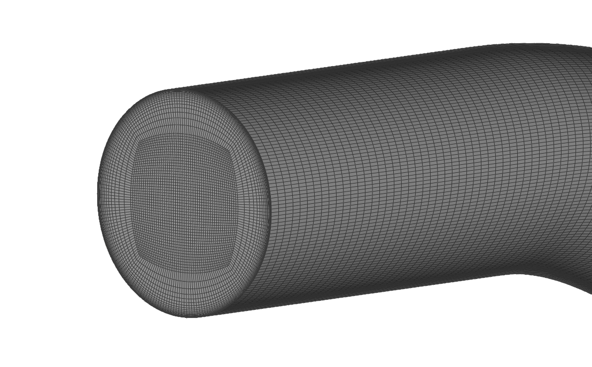
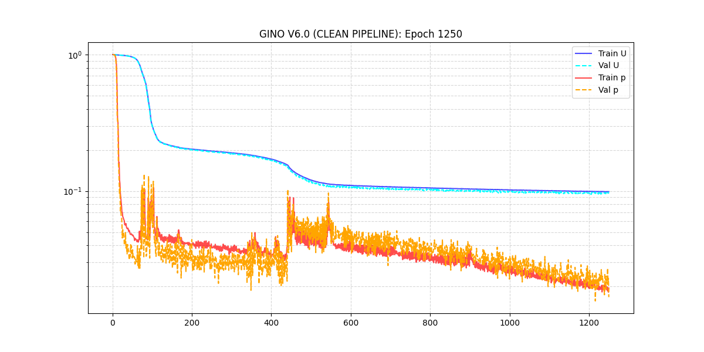
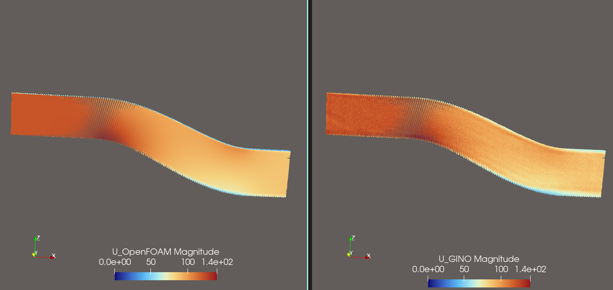
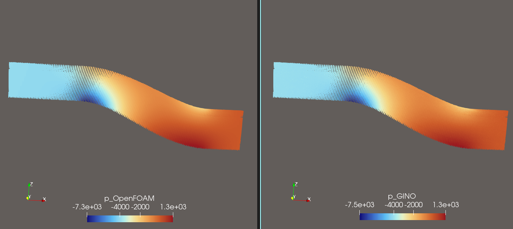
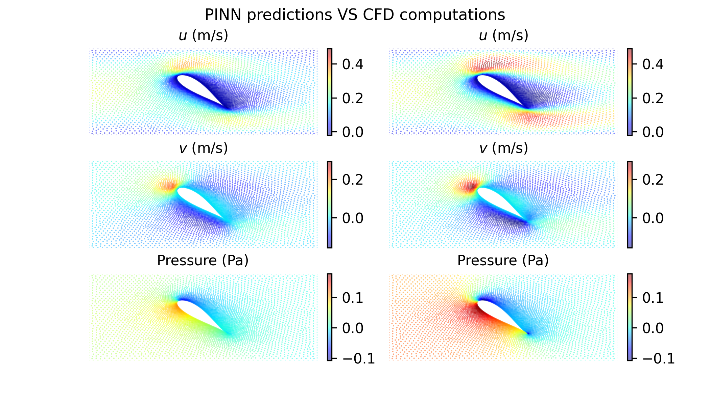

## Hello there
I am currently working on **Machine Learning for Computational Fluid Dynamics (CFD)**.

- Building fast & cost-effective surrogate models that replicates complex fluid dynamics problems using **Neural Operators**
- Aiming to publish my work and looking for new opportunities

---

## Featured projects

#### GINO – S-duct real-time prediction + DOE time reduction

#### GraphRAG-LLM automation + customised automation with data privacy

#### PINN airfoil AoA optimization + faster optimization

## Tech Stack
- **CFD & Simulation:** Simcenter STAR-CCM+, Ansys Fluent, OpenFOAM  
- **CAD / Meshing / Post:** ANSA, FreeCAD, Salome, ParaView  
- **AI / ML:** PyTorch, TensorFlow, GraphRAG, PINNs, GINO  
- **Programming:** Python, JavaScript  
- **DevOps / Tools:** Docker, GitHub, WSL, Colab  

---

## Contact
- Email: gm.prakash00@gmail.com  
- LinkedIn: https://www.linkedin.com/in/prakash-govindan-b364731b3/
